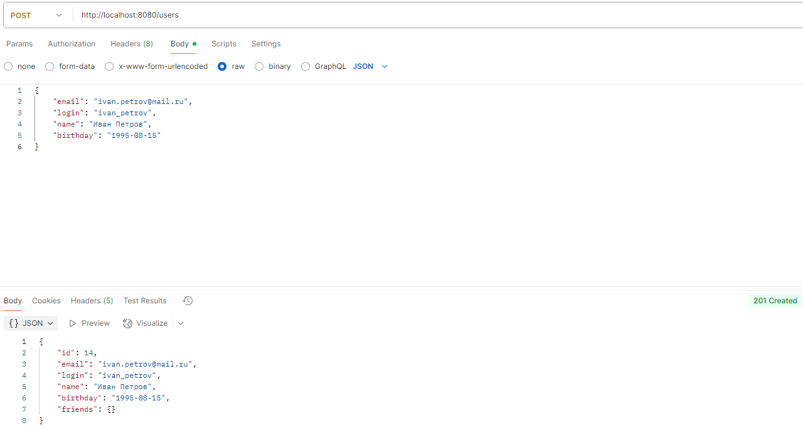

# Filmorate

**RESTful API сервис для оценки и рекомендации фильмов**

Backend-сервис, аналог Кинопоиск или IMDb, позволяющий пользователям находить фильмы, ставить им оценки (лайки), добавлять друзей и получать персональные рекомендации на основе общих вкусов. Реализован на Spring Boot с использованием чистой JDBC для полного контроля над SQL-запросами и понимания основ взаимодействия с реляционными базами данных.

## Технологии и инструменты

*   **Язык:** Java 21
*   **Фреймворк:** Spring Boot 3.2.4 (Web, Validation, JDBC, Test)
*   **База данных:** H2 (in-memory для разработки и тестирования)
*   **Библиотеки:** Project Lombok, JUnit 5, Mockito
*   **Логирование:** Logbook (для HTTP-трафика), SLF4J (для бизнес-логики)
*   **Система сборки:** Maven
*   **Документация API:** (Готов к интеграции Swagger/OpenAPI)

## Функциональность

Сервис предоставляет полноценный REST API для работы с киноплатформой:

*   **Управление пользователями:**
    *    Полный CRUD (Create, Read, Update, Delete) для пользователей.
    *    Добавление в друзья с двусторонним подтверждением (статусы `UNCONFIRMED`/`CONFIRMED`).
    *    Удаление из друзей с автоматическим обновлением статуса.
    *    Получение списка всех друзей пользователя.
    *    Поиск общих друзей между двумя пользователями.
*   **Управление фильмами:**
    *    Полный CRUD для фильмов.
    *    Проставление и удаление лайков.
    *    Получение топа самых популярных фильмов по количеству лайков (с возможностью ограничения вывода).
*   **Управление справочной информацией (MPA и жанры):**
    *    Получение списка всех рейтингов MPA (G, PG, PG-13, R, NC-17) и получение по ID.
    *    Получение списка всех жанров фильмов и получение по ID.
*   **Качество кода и надежность:**
    *    Комплексная валидация входящих данных на уровне контроллеров (`@Valid`) и бизнес-логики.
    *    Централизованная обработка исключений с помощью `@ControllerAdvice`.
    *    Покрытие unit-тестами слоя хранилища (`Data Access Layer`) с использованием `@JdbcTest`.
    *    Детальное логирование всех операций.

## Архитектура и ключевые решения

Проект реализован по классической **трехслойной архитектуре** с четким разделением ответственности:

1.  **Controller Layer (`controller/`):** REST-контроллеры, обрабатывающие HTTP-запросы. Отвечают за валидацию входных данных, маппинг и возврат ответов.
2.  **Service Layer (`service/`):** Содержит всю бизнес-логику. Обрабатывает комплексные сценарии (например, подтверждение дружбы), проверяет права доступа и делегирует операции хранилищу.
3.  **Storage/Repository Layer (`dal/`):** Отвечает исключительно за взаимодействие с базой данных. Реализован через **"Шаблонный метод"** с использованием абстрактного класса `BaseDbStorage`, что устраняет дублирование кода и обеспечивает единообразие всех операций CRUD.

**Что выделяет этот проект:**

*   **Работа с JDBC:** Вместо простого `JdbcTemplate` реализована абстракция `BaseDbStorage`, инкапсулирующая общие операции (`findOne`, `findMany`, `insert`, `update`), что значительно уменьшает количество шаблонного кода в конечных хранилищах.
*   **Обработка ошибок:** Единый обработчик (`ErrorHandler`) возвращает структурированные и понятные сообщения об ошибках для клиента (404, 500, 400).
*   **Использование Lombok:** Для уменьшения шаблонного кода (геттеры, сеттеры, конструкторы, логирование).
*   **Тщательное логирование:** Логируются как HTTP-запросы/ответы (через Logbook), так и ключевые действия бизнес-логики.

## Схема базы данных


# Запуск проекта

## Предварительные требования
- Установленный **JDK 21**
- Установленный **Maven 3.8+**

---

## 1. Клонирование и сборка
```bash
git clone https://github.com/ucheniks/java-filmorate.git
cd java-filmorate
mvn clean package
```

## 2. Запуск приложения
```bash
java -jar target/filmorate-0.0.1-SNAPSHOT.jar
```
Сервис будет доступен по адресу: [http://localhost:8080](http://localhost:8080)

> **Важно:** Приложение использует встроенную H2 базу данных в режиме файла (`./db/filmorate.mv.db`).  
> Данные сохраняются между перезапусками. База автоматически инициализируется скриптами `schema.sql` (создание таблиц) и `data.sql` (наполнение справочников) при первом запуске.

---

## 📡 API Reference

### Пользователи (`/users`)
| Метод | Эндпоинт | Описание |
|-------|----------|----------|
| GET   | /users | Получить всех пользователей |
| GET   | /users/{id} | Получить пользователя по ID |
| POST  | /users | Создать нового пользователя |
| PUT   | /users | Обновить данные пользователя |
| PUT   | /{id}/friends/{friendId} | Добавить друга |
| DELETE| /{id}/friends/{friendId} | Удалить друга |
| GET   | /{id}/friends | Список друзей пользователя |
| GET   | /{id}/friends/common/{otherId} | Список общих друзей |

### Фильмы (`/films`)
| Метод | Эндпоинт | Описание |
|-------|----------|----------|
| GET   | /films | Получить все фильмы |
| GET   | /films/{id} | Получить фильм по ID |
| POST  | /films | Создать новый фильм |
| PUT   | /films | Обновить данные фильма |
| PUT   | /{id}/like/{userId} | Поставить лайк фильму |
| DELETE| /{id}/like/{userId} | Удалить лайк с фильма |
| GET   | /popular?count={n} | Топ-N популярных фильмов |

### Справочники
- Рейтинги MPA: `GET /mpa`, `GET /mpa/{id}`  
- Жанры: `GET /genres`, `GET /genres/{id}`

---

## Примеры запросов

### Создание пользователя
```bash
curl -X POST -H "Content-Type: application/json" \
-d '{"email": "test@mail.com", "login": "test_login", "name": "Test User", "birthday": "1990-01-01"}' \
http://localhost:8080/users
```

### Добавление в друзья
```bash
curl -X PUT http://localhost:8080/users/1/friends/2
```

### Получение топ-5 фильмов
```bash
curl http://localhost:8080/films/popular?count=5
```

---

## Тестирование
Проект покрыт unit-тестами для слоя работы с данными (**Data Access Layer**) с использованием `@JdbcTest`, что обеспечивает изолированное тестирование с настоящей, но быстрой H2 базой данных.

### Запуск тестов
```bash
mvn test
```

---

## Скриншоты

**Пример работы с API (Postman)**  
  
Создание пользователя и успешный ответ **201 Created**.

**Пример обработки ошибок**  
  
Запрос несуществующего пользователя и четкий ответ **404 Not Found**.

## Вывод

Данный проект представляет собой **законченный бэкенд-сервис** с продуманной архитектурой и полным набором функциональности для работы с киноконтентом.  

Реализация демонстрирует понимание принципов разработки серверных приложений:  
- проектирование **REST API**,  
- работа с **базой данных**,  
- организация **бизнес-логики**,  
- обработка **ошибок** и исключений.  
