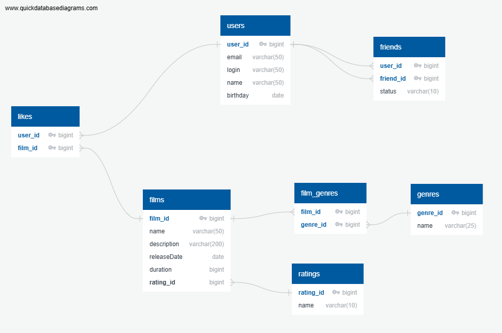

# java-filmorate
Template repository for Filmorate project.

## Database Schema

### users
*   user_id: bigint PK, FK -< likes.user_id
*   email: varchar(50)
*   login: varchar(50)
*   name: varchar(50)
*   birthday: date

### films
*   film_id: bigint PK, FK -< likes.film_id
*   name: varchar(50)
*   description: varchar(200)
*   releaseDate: date
*   duration: bigint
*   rating_id: bigint FK >- ratings.rating_id

### ratings
*   rating_id: bigint PK
*   name: varchar(10)

### film_genres
*   film_id: bigint FK >- films.film_id
*   genre_id: bigint FK >- genres.genre_id
*   PRIMARY KEY (film_id, genre_id)

### genres
*   genre_id: bigint PK
*   name: varchar(25)

### likes
*   user_id: bigint FK >- users.user_id
*   film_id: bigint FK >- films.film_id
*   PRIMARY KEY (user_id, film_id)

### friends
*   user_id: bigint FK >- users.user_id
*   friend_id: bigint FK >- users.user_id
*   status: varchar(10)
*   PRIMARY KEY (user_id, friend_id)

